# Linux基础命令

> 作者: 张大鹏
>
> 日期:2019年8月2日
>
> 抖音:lxgzhw
>
> 微博:理想国真恵玩
>
> 博客:http://lxgzhw520.com
>
> GitHub:https://github.com/lxgzhw520

## 001.查看系统版本

`cat /etc/centos-release`

## 002.查看ip地址

`ifconfig`

## 003.终端分类

- 设备终端
- 物理终端
- 虚拟终端
- 图形终端
- 串行终端
- 伪终端

## 004.查看终端

`tty`

## 005.查看终端 用户名  登录时间

`who am i`

## 006.查看用户名

`whoami`

## 007.查看shell类型

`echo $SHELL`

## 008.查看所有的shell

`cat /etc/shells`

## 009.查看主机名

`hostname`

## 010.切换文件夹

`cd`

## 011.查看提示符格式

`echo $PS1`

- `\u` 用户名
- `\h` 主机名
- `\W` 目录名

## 012.修改提示符格式

`PS1="\[\e[1;5;41;37m\][\u@\h \W]\\$\[\e[0m\]"`

> 可以将这一句加在 /root/.bash_profile的最后一行,使其永久生效

- 案例:红色的提示符

`PS1="\[\e[1;31m\][\u@\h \W]\\$\[\e[0m\]"`

## 013.判断命令为内部还是外部

`type 命名名`

> 如果告诉了命令的地址,则为外部命令
>
> 内部命令提示 `xxx is a shell builtin`

- 原理: 根据$PATH变量来寻找的
- 内部命令
  - 直接在内存中
- 外部命令
  - 找到以后加载到内存中

## 014.查看外部命令的路径

`whereis 外部命令名`

案例: `whereis hostname`

## 015.取别名

`alias 变量名="命令名"`

案例: `alias cdnet="cd /ect/sysconfig/network-scripts/"`

`unalias` 取消别名

## 016.查看文件内容

`cat`

案例: `cat ~/.bashrc`

## 017.查看内存使用情况

`free -h`

## 018.查看内核版本

`uname -r`

## 019.查看系统时间

`date`

用硬件时间覆盖系统时间 `clock -s`

## 020.查看硬件时间

`clock`

同步为系统时间 `clock -w`

## 021.同步服务器时间

`yum -y install ntpdate` 安装工具

`ntpdate pool.ntp.org` 同步网络时间

`clock -w` 将系统时间同步至硬件时间

## 022.关机命令

`poweroff`

## 023.重启命令

`reboot`

## 024.指定时间关机

`shutdown -h +10` 十分钟以后关机

`shutdown -c` 取消关机

## 025.屏幕共享

`yum -y install screen` 安装命令

`rpm -ivh xxx.rpm` 安装rpm包的命令(参考)

步骤:

- 1.开启屏幕共享 `screen -s help`
- 2.用另一个终端连接到同一台服务器
- 3.查看有哪些屏幕共享 `screen -ls`
- 4.连接屏幕共享 `screen -x help`
- 5.退出 `exit`

## 026.打印命令 

`echo`

发出声响 `echo -e "\a"`

## 027.创建文件

`touch`

- 案例: 创建一个空文件

`touch file.txt`

- 案例: 同时创建多个文件`笛卡尔乘积`

`touch /data/file{1,2,3}.{txt,log}`

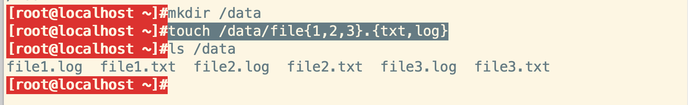

- 案例: 自动根据日期生成日志文件

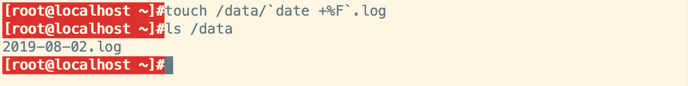

这里用到了命令嵌套,反向单引号里面的是一个Linux命令,能够生成日期

反向单引号一般是命令调用命令的时候使用,和$()是等价的

- 案例:生成范围的数字或字母

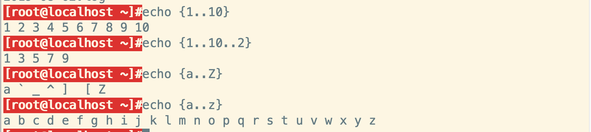

## 028.查看历史命令

`history`

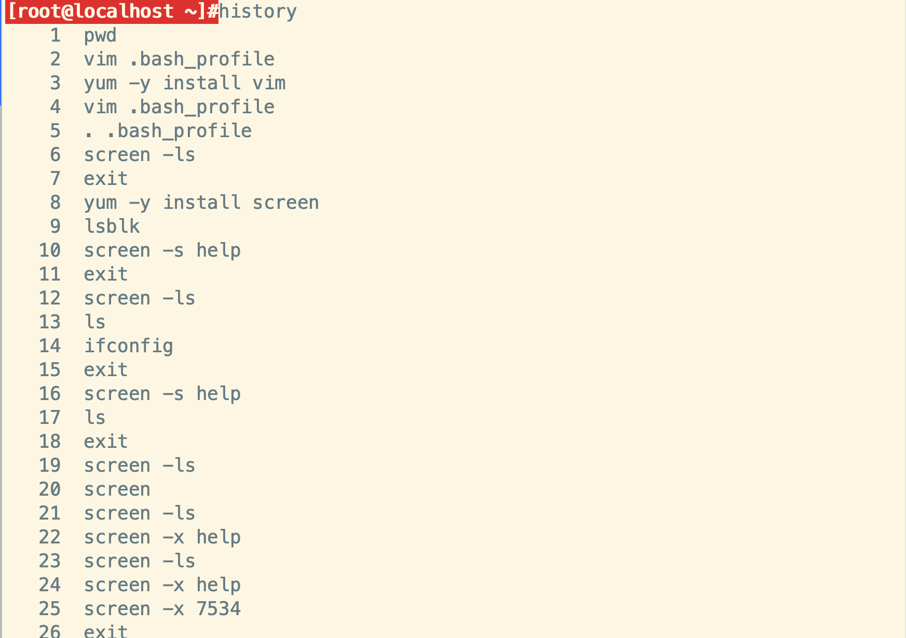

- 命令存储在 `.bash_history`文件中
- 执行命令历史中最近的以s开头的 `!s`
- 执行命令历史中包含某内容的命令 `!?包含的内容`
- `alt + .`能够将上一个命令的参数作为此次命令的参数

## 029.查看日历

`cal`

`cal 09 1999`查看1999年9月的日历

`cal 2019` 查看2019年的日历

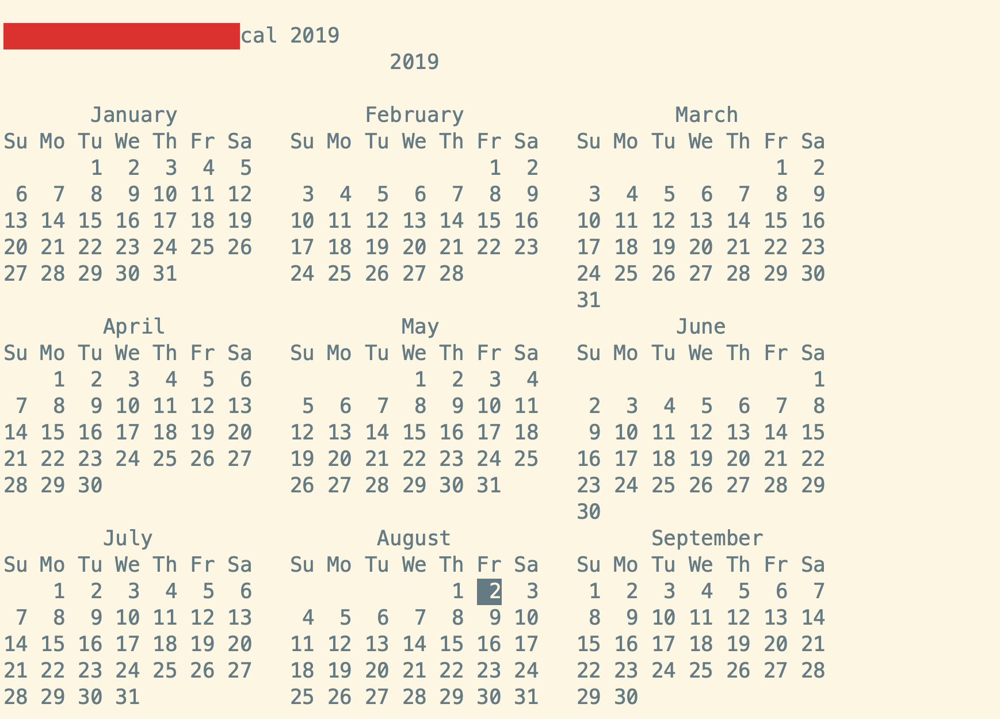

## 030.计算器命令

`bc`

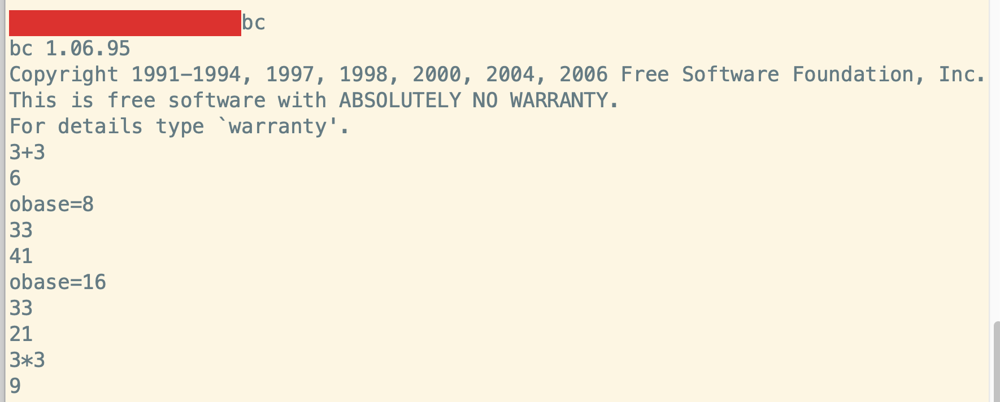

- `obase=8`转换为8进制
- `obase=16`转换为16进制
- `obase=2`转换为2进制

## 031.查看帮助

`whatis 命令名`

查看一个命令的基本介绍

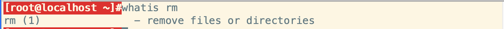

`type 命令名`

查看是内部命令还是外部命令

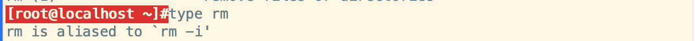

`man 命令名`

查看命令的详细介绍

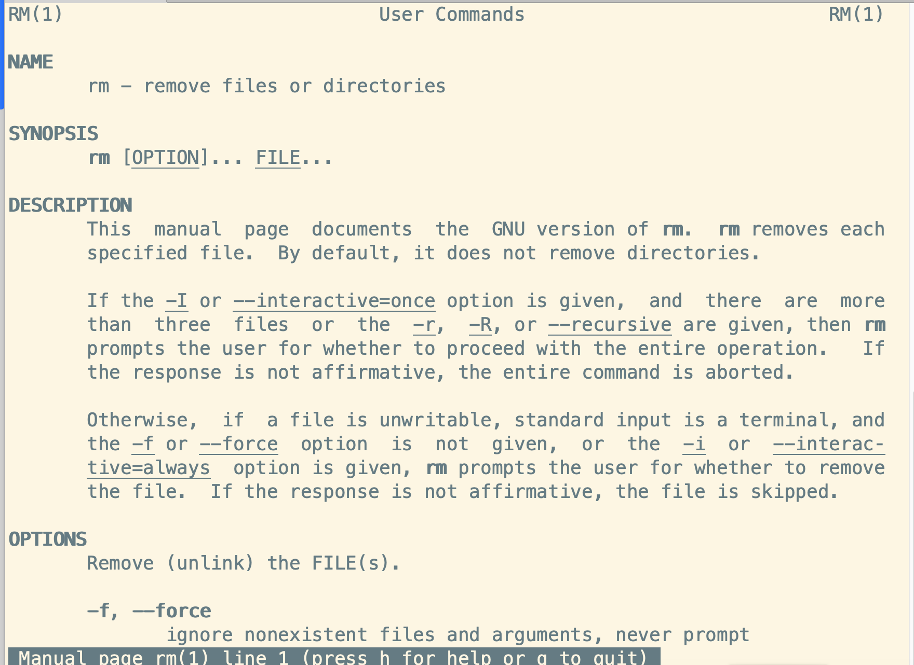

## 032.查看物理路径

`pwd -P`

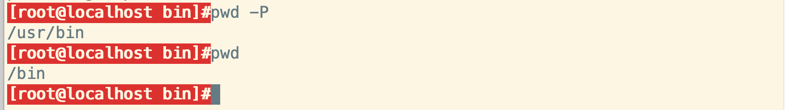

## 033.从路径中获取文件或文件夹名字

`basename` 获取文件名字

`dirname` 获取文件夹名字

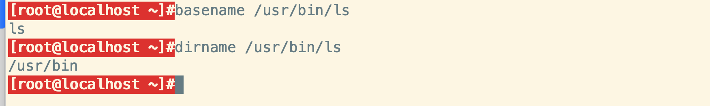

## 034.切换文件夹

`cd` 回到家目录

`cd -`回到上次的目录

`cd 文件夹路径` 切换到文件夹路径所在位置

## 035.列出目录内容

`ls -a`包含隐藏文件

`ls -l`显示额外的信息

`ls -R`目录递归

## 036.查看文件状态

`stat`

- 访问时间
- 修改时间:文件内容发生改变
- 改变时间:文件所有者等非内容信息发生改变

## 037.复制文件和目录

`cp`

- 案例:复制文件

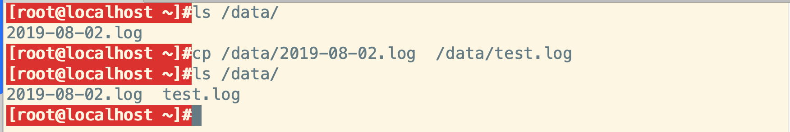

- 案例:复制文件夹

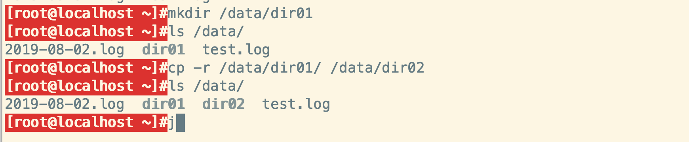

## 038.移动文件夹

`mv`

- 案例:移动文件夹

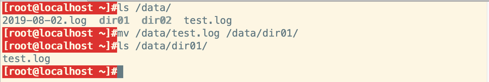

- 案例:重命名文件夹

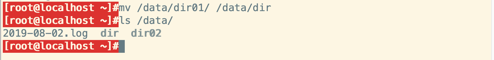

## 039.删除文件夹

`rm`

- 案例:删除文件

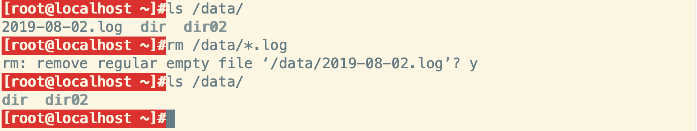

- 案例:删除文件夹

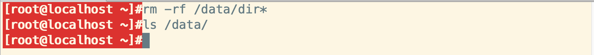

## 040.创建目录

`mkdir`

- 案例:创建一个目录

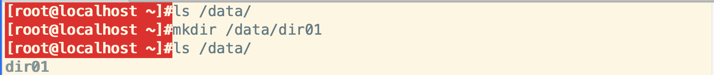

- 案例:创建多个目录

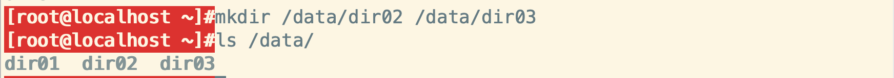

- 案例:递归创建多级目录

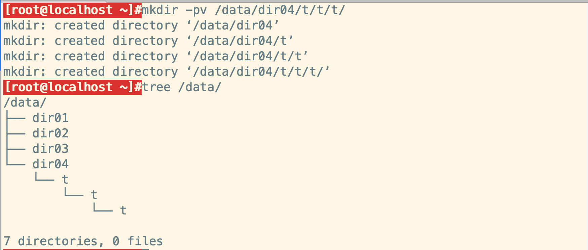

## 041.查看目录树

`yum -y install tree`安装命令

`tree /data/`执行命令

- 案例:查看/data下面的目录树

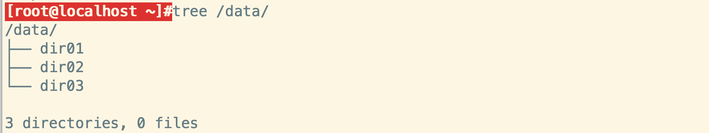

## 042.删除空目录

`rmdir`

- 案例:递归删除/data/dir04下的空目录(包含dir04)

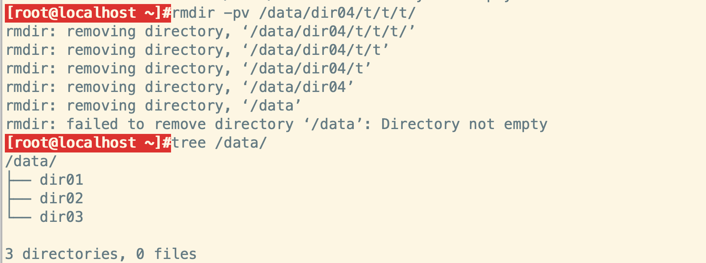

## 043.查看文件的类型

`file`

- 案例:查看文件的类型

- 案例:查看文件夹的类型

## 044.重定向

`>` 写入 `w模式`

`>>`追加 `a模式`

- 案例:将输出重定向到文件

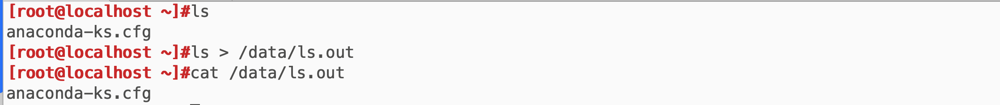

- 案例:将输出重定向到另一个终端

`set -C`禁止覆盖

`set +C`允许覆盖

- 案例:标准错误的重定向

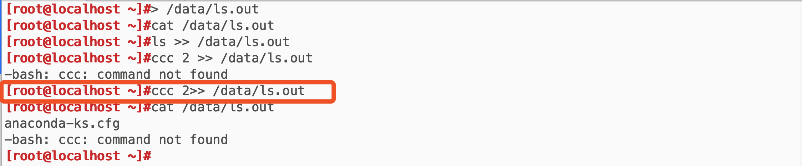

- 案例:快速生成一份月历

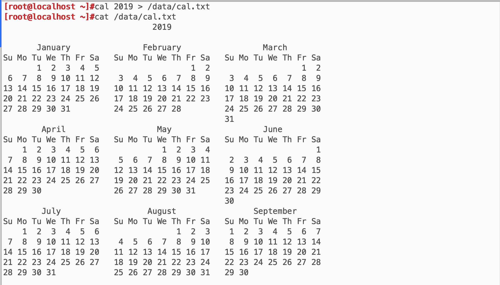

- 案例:标准输入的重定向

>  `<`将文件内容作为左边的输入内容

- 案例:将小写转换为大写

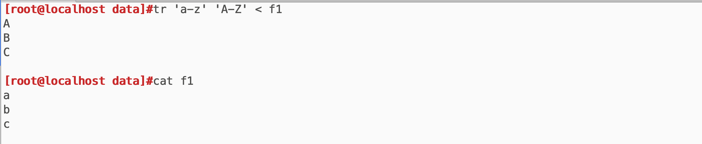

- 案例: 删除指定的内容`-d`

## 045.管道

`|`

> 将前一个命令的执行结果作为后一个命令的参数

- 案例:将ls的结果全部转换为大写

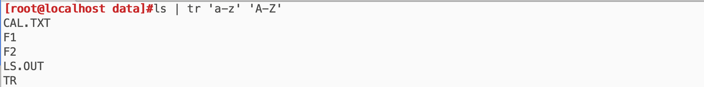

## 046.搜索内容

`grep`

- 案例:搜索inet

## 047.重定向且继续显示

`tee`

- 案例

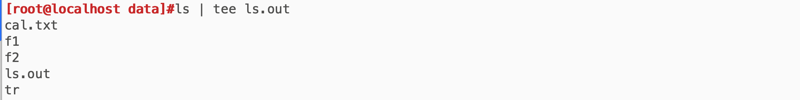

