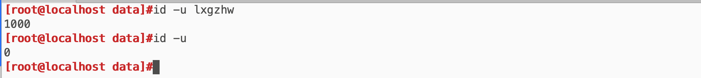
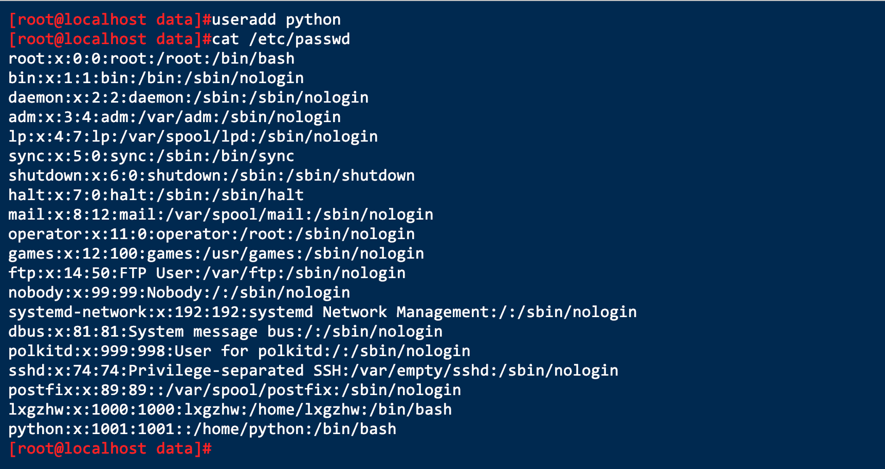
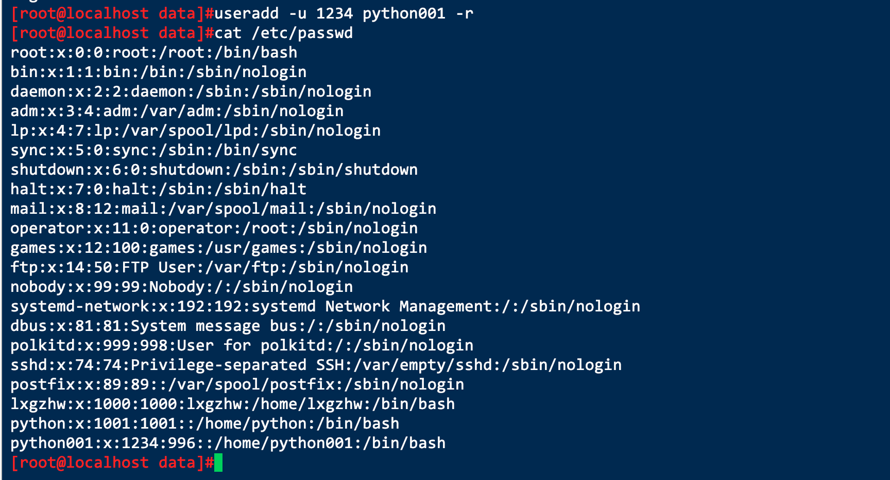
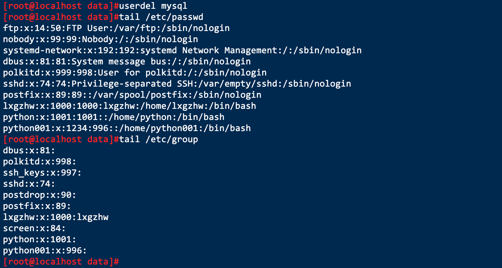
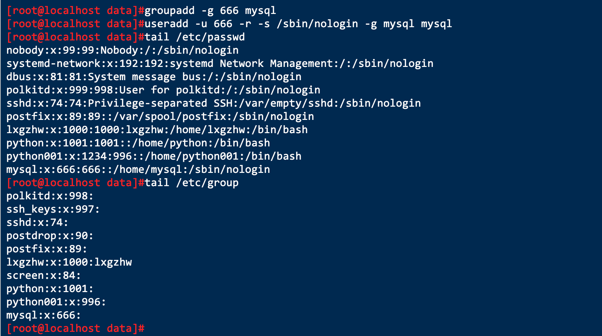
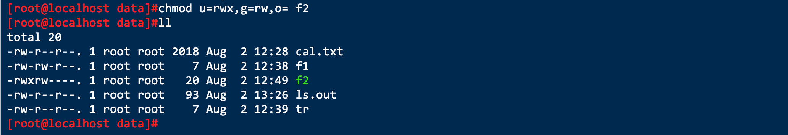

# Linux用户账户管理及权限

> 作者:张大鹏
>
> 时间:2019年8月2日
>
> 抖音:lxgzhw
>
> 微博:理想国真恵玩
>
> 博客:http://lxgzhw520.com
>
> GitHub:https://github.com/lxgzhw520

## 001.查看用户的uid

`id`

- 案例:查看用户`lxgzhw`的uid

> uid从1000开始,1-999是给系统服务使用的

## 002.组的类别

- 主要组
  - 一个用户只有一个主要组
  - 组名同用户名,仅包含一个用户,是私有组
- 附加组
  - 一个用户可以属于多个附加组

## 003.用户和组的配置文件

`/etc/passwd` 用户及其属性信息(名称,UID,主组ID等)

`/etc/group`组及其属性信息

`/etc/shadow`用户密码及其相关属性

`/etc/gshadow`组密码及其相关属性

## 004.用户管理命令

- `useradd`
- `usermod`
  - 锁定用户 `usermod -L python`
  - 解锁用户 `usermode -U python`
- `userdel`

> 案例:添加一个用户

> 案例:创建一个系统用户

`useraddd -u 1234 python001 -r`

- `-r`表示创建系统用户
- 创建系统用户不会自动创建家目录
- `-u`表示指定uid

> 案例:删除用户

> 删除用户的同时,与用户同名的主组也会被删除

> 案例:创建组并创建新用户指定组

## 005.组管理命令

- `groupadd`
- `groupmod`
- `groupdel`
- `gpasswd`

> 案例:创建一个mysql组

> 案例:创建一个mysql用户并指定主组

> 优化建议: `useradd -u 666 -r -s /sbin/nologin -g mysql mysql`

> 案例:给用户添加辅助组

- `-a`表示保留原来的辅助组

## 006.修改用户密码

- `passwd 用户名`

> 案例:修改python的密码

> 案例:一次性修改用户密码的方法

## 007.切换用户

登录模式切换 `su - 用户名`

非登录模式切换 `su 用户名`

> 注意:不要频繁切换,切换会消耗系统资源.先`exit`退出,再切换

## 008.文件权限

- `chown`设置文件的所有者
- `chgrp`设置文件的所属组信息
- `chmod`修改文件的权限
- 权限分类
  - 可读 `r`  `4`
  - 可写 `w` `2`
  - 可执行 `x` `1`

> 只有具备访问权限的用户,才能访问该文件

> 常见的权限组合

- 777
  - 所有者 可读可写可执行 `rwx`
  - 所属组 可读可写可执行 `rwx`
  - 其他人 可读可写可执行 `rwx`
- 775
  - 所有者 可读可写可执行 `rwx`
  - 所属组 可读可写可执行 `rwx`
  - 其他人 可读可写 `rx`

## 009.修改文件权限

- 案例:给组添加可写权限

- 案例:对权限多个直接赋值

- 案例:对权限单个进行赋值

> 小知识:有执行权限,颜色就会变为绿色

- 案例:用数字法修改文件权限

