# 文本处理工具

> 作者: 张大鹏


## 001.分页查看文件

`more`


## 002.查看文件前几行

`head`

查看前三行 `head -n 3`

- 案例:查看第一行inet

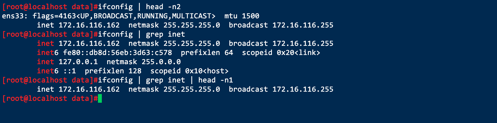


## 003.查看文件末尾几行

`tail`

`tail -n 3`查看指定行数

`tail -f`跟踪文件


## 004.截取命令

`cut`


- 案例:

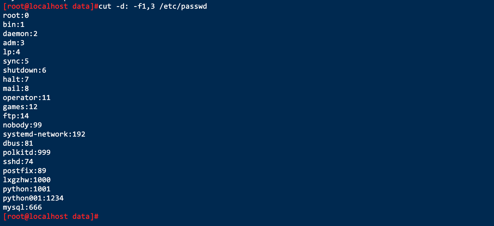

- `-d` 跟指定的分隔符
- `-f`跟分割以后的区间,类似于数组的截取范围


- 案例:截取df命令输出的`Used列信息`

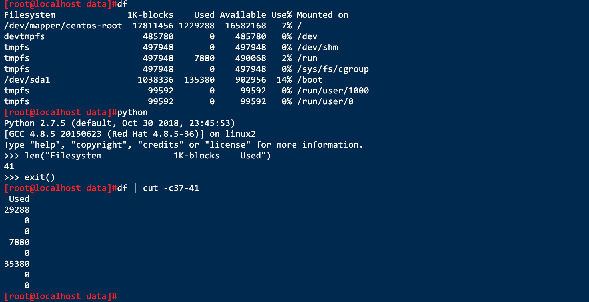


- 案例:截取ip地址

`ifconfig |grep inet|cut -c13-27|head -n 1`

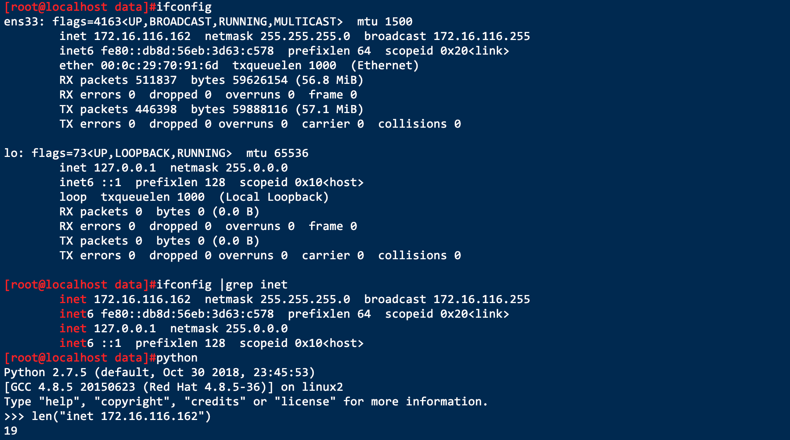


## 005.grep文本过滤

作用:文本搜索工具,根据用户指定的模式对目标文本逐行进行匹配检查,打印匹配到的行

模式:由正则表达式字符及文本字符所编写的过滤条件


- 案例:搜索包含root的行

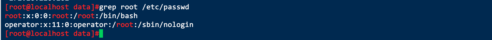


- 案例:搜索当前用户名

> 方法1

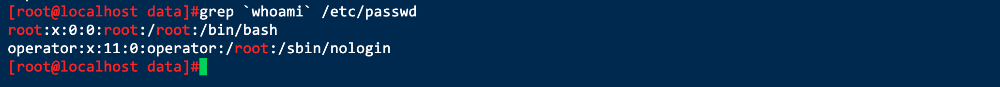

> 方法2


## 006.sed文本编辑

- 案例:生成一行的数字


- 案例:生成一列的数字


- 案例:查看分区利用率

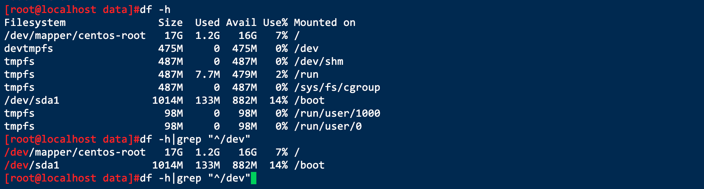


- 案例:分组的重复利用


> 这里的 `\1` 表示的是 `\(root\)`


- 案例:匹配 `rxxt`连续出现两次的行

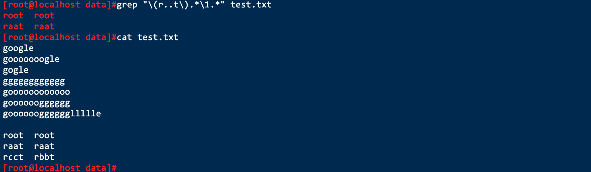


## 007.awk文本报告生成器


## 008.正则表达式

程序支持:grep,sed,awk,vim,less,nginx,varnish

分类:基本BRE,扩展,ERE

字符匹配:

```
. 匹配任意单个字符
[] 匹配指定范围内的任意单个字符
[^] 匹配指定范围以外的任意单个字符
[:alnum:] 字母和数字
[:alpha:] 任意单个英文字母
[:lower:] 小写字母
[:upper:] 大写字母
[:blank:] 空白字符
[:space:] 水平和垂直的空白字符
[:cntrl:] 不可打印的控制字符(退格,删除,警铃...)
[:digit:] 十进制数字
[:xdigit:] 十六进制数字
[:print:] 可打印字符
[:graph:] 可打印的非空白字符
[:punct:] 标点符号
```


匹配次数

```
* 匹配0次或多次,贪婪模式,尽可能长的匹配
.* 匹配任意长度的任意字符
\? 匹配其签名的字符0次或1次
\+ 匹配其前面的字符至少1次
\{n\} 匹配前面的字符n次
\{m,n\} 匹配前面的字符m到n次
\{n,\} 匹配前面的字符至少n次
\{,m\} 匹配前面的字符最多m次
```


位置锚定

```
^ 行首锚定,用于模式最左侧
$ 行尾锚定
\< 词首锚定
\> 词尾锚定
```


- 案例:匹配o出现2次的情况


- 案例:匹配o至少出现一次


- 案例:任意单个字符的使用

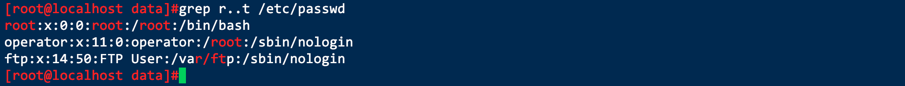


- 案例:匹配ifconfig输出结果中被三个点隔开的内容(ip地址)所在的行

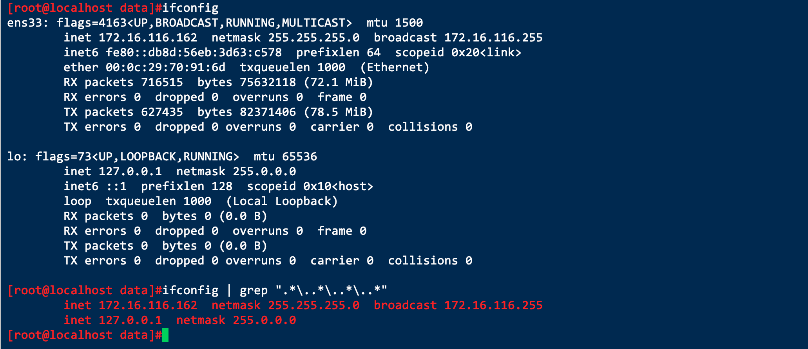

> 核心语句: `ifconfig | grep ".*\..*\..*\..*"`


- 案例:匹配root开头的行


- 案例:匹配以nologin结尾的行


- 案例:匹配整行为`google`的行


- 案例:匹配以`#`开头的行

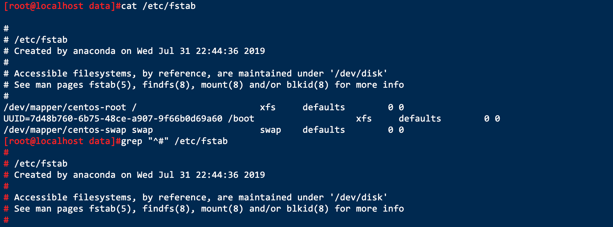


- 案例:匹配单词以`r`开头的行

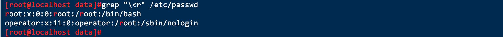


